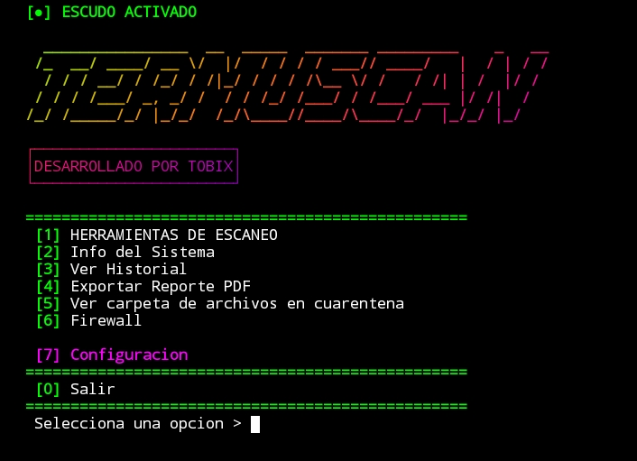

# TERMUSCAN v8.5 🛡️
### Antivirus + Firewall para Termux | Desarrollado por TOBIX


Un Antivirus 100% en Bash para Termux. Escanea, detecta scripts maliciosos, pone en cuarentena y bloquea puertos sospechosos. Con UI tipo Kaspersky Mobile.

<p align="center">
  
</p>

---

### [●] ESCUDO ACTIVADO - Características

| Módulo | Descripción |
| --- | --- |
| **[1] HERRAMIENTAS DE ESCANEO** | Escaneo Rápido y Escaneo Profundo. Detecta `nc`, `curl`, `bash -i`, `keylogger`, `reverse_shell`, `rm -rf /` y mas |
| **[2] Info del Sistema** | Muestra Modelo, Android, Kernel, Arquitectura y ruta de Termux |
| **[3] Ver Historial** | Guarda los últimos 5 escaneos |
| **[4] Exportar Reporte PDF** | Genera un `TERMUSCAN_Reporte.pdf` en `/sdcard` |
| **[5] Cuarentena** | Mueve amenazas a una carpeta para anular cualquier amenaza |

## ❗REQUISITOS:
* TERMUX (emulador de terminal en android)
* Instalar algunas funciones para que se use correctamente:
```bash
pkg update && pkg upgrade -y 
pkg install figlet toilet lolcat net-tools termux-tools -y
termux-setup-storage
```


# ⚡SCRIPT:
```bash
#!/bin/bash
# TERMUSCAN v8.5 - DESARROLLADO POR TOBIX

clear
COLOR="\e[1;32m"; RESET="\e[0m"; SONIDO="ON"; VIBRA="ON"; NOMBRE_SCRIPT="toby.sh"
LOG_FILE="$PREFIX/var/termuscan.log"; REPORTE_PDF="/sdcard/TERMUSCAN_Reporte.pdf"
CUARENTENA_DIR="/sdcard/TERMUSCAN_Cuarentena"
LISTA_BLANCA="$PREFIX/var/termuscan_whitelist.txt"
PATHS_ESCANEAR=("$PREFIX/usr/bin" "/sdcard/Download" "$PREFIX/var/cache")
ULTIMO_RESULTADO="Sin escanear"; ULTIMO_ARCHIVO_MALO=""
mkdir -p "$CUARENTENA_DIR"
if command -v lolcat &> /dev/null; then LOLCAT="lolcat"; else LOLCAT="cat"; fi

banner(){ clear; echo -e "\e[1;32m[●] ESCUDO ACTIVADO\e[0m"; echo -e "${COLOR}"; figlet -f slant "TERMUSCAN" 2>/dev/null | $LOLCAT; toilet -f term -F border "DESARROLLADO POR TOBIX" 2>/dev/null | $LOLCAT; echo -e "${RESET}"; echo -e "${COLOR}=================================================${RESET}"; }
banner_submenu(){ clear; echo -e "\e[1;32m[●] ESCUDO ACTIVADO\e[0m"; echo -e "${COLOR}"; figlet -f small "HERRAMIENTAS DE ESCANEO" 2>/dev/null | $LOLCAT; echo -e "${RESET}"; echo -e "${COLOR}=================================================${RESET}"; }
banner_firewall(){ clear; echo -e "\e[1;32m[●] ESCUDO ACTIVADO\e[0m"; echo -e "\e[1;31m╔════════╗\e[0m"; echo -e "\e[1;31m║\e[0m \e[1;31m$(figlet -f smmono9 "FIREWALL" 2>/dev/null | head -1)\e[0m \e[1;31m║\e[0m"; echo -e "\e[1;31m╚════════╝\e[0m"; echo -e "${COLOR} Panel de Seguridad de Red ${RESET}\n"; }
banner_config(){ clear; echo -e "\e[1;32m[●] ESCUDO ACTIVADO\e[0m"; echo -e "\e[1;35m╔═══════════════╗\e[0m"; echo -e "\e[1;35m║\e[0m \e[1;35m$(figlet -f smmono9 "CONFIG" 2>/dev/null | head -1)\e[0m \e[1;35m║\e[0m"; echo -e "\e[1;35m╚═══════════════╝\e[0m"; echo -e "${COLOR} Panel de Ajustes Avanzados ${RESET}\n"; }
animacion_matrix(){ clear; echo -e "\e[1;32m[●] ESCUDO ACTIVADO\e[0m"; echo -e "${COLOR}[*] Generando Reporte...${RESET}\n"; chars="01"; colors=("\e[1;31m" "\e[1;32m" "\e[1;34m" "\e[1;35m" "\e[1;36m" "\e[1;33m"); for i in {1..60}; do color=${colors[$RANDOM % ${#colors[@]}]}; char=${chars:$RANDOM%2:1}; echo -ne "$color$char"; sleep 0.05; done; echo -e "\n${RESET}"; sleep 0.3; }
animacion_matrix_roja(){ clear; echo -e "\e[1;31m[●] ACCION EN CURSO\e[0m\n"; for i in {1..30}; do echo -ne "\e[1;31m1\e[0m"; sleep 0.03; done; echo -e "\n"; sleep 0.2; }
alerta(){ if [ "$SONIDO" = "ON" ]; then echo -e "\a"; fi; if [ "$VIBRA" = "ON" ] && command -v termux-vibrate &>/dev/null; then termux-vibrate -d 300; fi; }

cambiar_color(){ banner_config; echo -e " ${COLOR}[1]${RESET} Verde [2] Cian [3] Rojo"; echo -e " ${COLOR}[4]${RESET} Amarillo [5] Morado"; echo ""; read -p " Elige color > " col; case $col in 1) COLOR="\e[1;32m";; 2) COLOR="\e[1;36m";; 3) COLOR="\e[1;31m";; 4) COLOR="\e[1;33m";; 5) COLOR="\e[1;35m";; esac; echo -e "${COLOR}[✓] Color aplicado.${RESET}"; sleep 1; }
menu_configuracion(){ while true; do banner_config; echo -e " \e[1;35m[1]\e[0m Cambiar Tema : \e[1;36m$COLOR<Actual>\e[0m"; echo -e " \e[1;35m[2]\e[0m Sonido de Alerta : \e[1;33m[$SONIDO]\e[0m"; echo -e " \e[1;35m[3]\e[0m Vibración de Alerta : \e[1;33m[$VIBRA]\e[0m"; echo -e " \e[1;35m[0]\e[0m Volver al Menu Principal"; echo -e "\e[1;35m───────────────────────────────────────────────\e[0m"; read -p " Selecciona una opcion > " cfg; case $cfg in 1) cambiar_color ;; 2) if [ "$SONIDO" = "ON" ]; then SONIDO="OFF"; else SONIDO="ON"; fi; echo -e "${COLOR}[✓] Sonido: $SONIDO${RESET}"; sleep 1 ;; 3) if [ "$VIBRA" = "ON" ]; then VIBRA="OFF"; else VIBRA="ON"; fi; echo -e "${COLOR}[✓] Vibracion: $VIBRA${RESET}"; sleep 1 ;; 0) break ;; *) echo -e "\e[1;31mOpcion invalida\e[0m"; sleep 1 ;; esac; done; }

efecto_escaneo(){ echo -ne "${COLOR}[*] Escaneando "; for i in {1..20}; do echo -ne "#"; sleep 0.05; done; echo -e " 100%${RESET}"; }
ascii_limpio(){ echo -e "${COLOR} __ ___ \n| | / \ / \n| | / \ / ^ \n| | / /\ \ /_\ \n| |___| |___ / ____ \ / _____ \n|_______|____|/__/ \__\ /__/ \__\ \n SISTEMA LIMPIO - NO SE DETECTARON AMENAZAS${RESET}"; }

menu_firewall(){
    while true; do
        banner_firewall
        echo -e " ${COLOR}[1]${RESET} Ver conexiones activas"
        echo -e " ${COLOR}[2]${RESET} Escanear puertos abiertos"
        echo -e " ${COLOR}[3]${RESET} Bloquear puerto 4444"
        echo -e " ${COLOR}[0]${RESET} Volver al Menu Principal"
        echo -e "${COLOR}=================================================${RESET}"
        read -p " Selecciona una opcion > " fw
        case $fw in
            1) banner_firewall; echo -e "${COLOR}[+] Conexiones TCP Activas:${RESET}\n"; netstat -tupn 2>/dev/null | head -n 15; echo ""; read -p " Presiona ENTER..." x ;;
            2) banner_firewall; echo -e "${COLOR}[+] Escaneando puertos 1-1000...${RESET}\n"; efecto_escaneo; OPEN=$(netstat -tuln 2>/dev/null | grep LISTEN); if [ -z "$OPEN" ]; then echo -e "\e[1;32m[✓] No hay puertos abiertos peligrosos.${RESET}"; else echo -e "\e[1;31m[!] Puertos abiertos detectados:\e[0m\n$OPEN"; fi; echo ""; read -p " Presiona ENTER..." x ;;
            3) banner_firewall; echo -e "${COLOR}[+] Bloqueando puerto 4444...${RESET}"; PID=$(netstat -tulpn 2>/dev/null | grep ':4444' | awk '{print $7}' | cut -d'/' -f1); if [! -z "$PID" ]; then kill -9 $PID 2>/dev/null; animacion_matrix_roja; echo -e "\e[1;31m[✓] Puerto 4444 bloqueado. PID $PID eliminado.\e[0m"; else echo -e "\e[1;32m[✓] Puerto 4444 ya esta cerrado.\e[0m"; fi; echo ""; read -p " Presiona ENTER..." x ;;
            0) break ;;
            *) echo -e "\e[1;31mOpcion invalida\e[0m"; sleep 1 ;;
        esac
    done
}

info_sistema(){ banner; echo -e "${COLOR}[+] Informacion del Dispositivo${RESET}\n"; echo -e " ${COLOR}Modelo:${RESET} $(getprop ro.product.model 2>/dev/null || echo "N/A")"; echo -e " ${COLOR}Android:${RESET} $(getprop ro.build.version.release 2>/dev/null || echo "N/A")"; echo -e " ${COLOR}Kernel:${RESET} $(uname -r)"; echo -e " ${COLOR}Arquitectura:${RESET} $(uname -m)"; echo -e " ${COLOR}Termux:${RESET} $PREFIX"; echo ""; read -p " Presiona ENTER para volver..." x; }
menu_accion_amenaza(){ local archivo=$1; ULTIMO_ARCHIVO_MALO=$archivo; while true; do banner; alerta; echo -e "\e[1;31m _______ \n| || _ || _ || _ |\n| _____|| |_| || |_| || |_| |\n|_____ | || |\n|_____ || |\n_____| || _ || _ || _ |\n|_______||__| |__||__| |__||__| |__|\n ¡AMENAZA DETECTADA!\e[0m"; echo -e "${COLOR} Archivo: ${RESET}$archivo\n"; echo -e " ${COLOR}[1]${RESET} Ignorar > Solo esta vez"; echo -e " ${COLOR}[2]${RESET} Cuarentena > Mover a carcel segura"; echo -e " ${COLOR}[3]${RESET} Borrar Ya > Eliminar definitivo"; echo -e " ${COLOR}[4]${RESET} Ver Detalle > Ver codigo sospechoso"; echo -e " ${COLOR}[5]${RESET} Añadir a Excepciones > No detectar mas"; echo -e " ${COLOR}[0]${RESET} Volver"; echo -e "${COLOR}=================================================${RESET}"; read -p " Selecciona una opcion > " acc; case $acc in 1) echo -e "${COLOR}[i] Ignorado.${RESET}"; sleep 1; break ;; 2) poner_cuarentena "$archivo"; break ;; 3) borrar_archivo "$archivo"; break ;; 4) ver_detalle "$archivo"; ;; 5) echo "$archivo" >> "$LISTA_BLANCA"; echo -e "${COLOR}[✓] Añadido a excepciones.${RESET}"; sleep 1; break ;; 0) break ;; *) echo -e "\e[1;31mOpcion invalida\e[0m"; sleep 1 ;; esac; done; }
poner_cuarentena(){ animacion_matrix_roja; mv "$1" "$CUARENTENA_DIR/$(basename $1).bak" 2>/dev/null; chmod 000 "$CUARENTENA_DIR/$(basename $1).bak" 2>/dev/null; echo -e "${COLOR}[✓] Movido a Cuarentena: $CUARENTENA_DIR${RESET}"; guardar_historial "Amenaza-Cuarentena"; sleep 2; }
borrar_archivo(){ animacion_matrix_roja; rm -f "$1"; echo -e "\e[1;31m[✓] Archivo eliminado.${RESET}"; guardar_historial "Amenaza-Borrado"; sleep 2; }
ver_detalle(){ banner; echo -e "${COLOR}[+] Detalle del archivo: $1${RESET}\n"; grep -i -E "curl|wget|nc|netcat|bash -i|keylogger|spy" "$1" -n 2>/dev/null | head -n 5; echo ""; read -p " Presiona ENTER..." x; }
menu_cuarentena(){ banner; echo -e "${COLOR}[+] Carpeta de Archivos en Cuarentena${RESET}\n"; FILES=($(ls "$CUARENTENA_DIR"/*.bak 2>/dev/null)); if [ ${#FILES[@]} -eq 0 ]; then echo -e "\e[1;33m[~] La cuarentena esta vacia.\e[0m"; else for i in "${!FILES[@]}"; do echo -e " ${COLOR}[$((i+1))]\e[0m $(basename ${FILES[$i]})"; done; echo ""; read -p " Elige numero para [R]estaurar [B]orrar o [0] Salir > " sel; if [[ "$sel" =~ ^[0-9]+$ ]] && [ "$sel" -gt 0 ] && [ "$sel" -le ${#FILES[@]} ]; then ARCH=${FILES[$((sel-1))]}; read -p " [R]estaurar o [B]orrar? > " rb; if [[ "$rb" == "R" || "$rb" == "r" ]]; then mv "$ARCH" "/sdcard/$(basename $ARCH.bak)"; chmod 644 "/sdcard/$(basename $ARCH.bak)"; echo -e "${COLOR}[✓] Restaurado a /sdcard/${RESET}"; elif [[ "$rb" == "B" || "$rb" == "b" ]]; then rm -f "$ARCH"; echo -e "\e[1;31m[✓] Borrado de cuarentena.${RESET}"; fi; fi; fi; echo ""; read -p " Presiona ENTER..." x; }

guardar_historial() { local resultado=$1; ULTIMO_RESULTADO=$resultado; local fecha=$(date "+%d/%m %H:%M"); echo "$fecha - $resultado" >> "$LOG_FILE"; tail -n 5 "$LOG_FILE" > "$LOG_FILE.tmp" && mv "$LOG_FILE.tmp" "$LOG_FILE"; }
ver_historial() { banner; echo -e "${COLOR}[+] Historial de Escaneos${RESET}\n"; if [ -f "$LOG_FILE" ] && [ -s "$LOG_FILE" ]; then cat "$LOG_FILE" | nl -w2 -s') ' | $LOLCAT; else echo -e "\e[1;33m[~] Aun no hay escaneos registrados.\e[0m"; fi; echo ""; read -p " Presiona ENTER para volver..." x; }
exportar_pdf(){ banner; animacion_matrix; echo -e "${COLOR}[+] Creando Reporte PDF...${RESET}"; FECHA=$(date "+%d/%m/%Y %H:%M:%S"); MODEL=$(getprop ro.product.model 2>/dev/null || echo "N/A"); ANDROID=$(getprop ro.build.version.release 2>/dev/null || echo "N/A"); cat > "$REPORTE_PDF" <<EOF
<html><body style="font-family: monospace; background:#0f0f0f; color:#00ff00;">
<h1 style="text-align:center; color:#00ff00;">REPORTE TERMUSCAN</h1><hr>
<p><b>Fecha:</b> $FECHA</p><p><b>Dispositivo:</b> $MODEL</p><p><b>Android:</b> $ANDROID</p>
<p><b>Estado del Escudo:</b> ACTIVADO</p><p><b>Ultimo Resultado:</b> $ULTIMO_RESULTADO</p>
<h2>Historial de Escaneos</h2><pre>$(cat $LOG_FILE 2>/dev/null || echo "Sin historial")</pre>
<hr><p style="text-align:center;">Desarrollado por TOBIX - TERMUSCAN v8.5</p>
</body></html>
EOF
    if [ -f "$REPORTE_PDF" ]; then echo -e "${COLOR}[✓] Reporte guardado en: ${RESET}$REPORTE_PDF"; else echo -e "\e[1;31m[!] Error al crear el reporte.\e[0m"; fi; echo ""; read -p " Presiona ENTER para volver..." x; }

escanear_rapido(){
    banner_submenu; echo -e "${COLOR}[+] Iniciando Escaneo Rápido...${RESET}"; efecto_escaneo;
    KEYWORDS="curl|wget|nc|netcat|bash -i|chmod 777|rm -rf /"; AMENAZAS=0;
    for dir in "${PATHS_ESCANEAR[@]}"; do if [ -d "$dir" ]; then
        find "$dir" -type f! -name "$NOMBRE_SCRIPT" 2>/dev/null | while read -r file; do
            if grep -q "$file" "$LISTA_BLANCA" 2>/dev/null; then continue; fi
            RESULT=$(grep -i -E "$KEYWORDS" "$file" 2>/dev/null); if [! -z "$RESULT" ]; then echo -e "\n\e[1;31m[!] Sospechoso: $file\e[0m"; AMENAZAS=1; menu_accion_amenaza "$file"; fi;
        done
    fi; done;
    if [ "$AMENAZAS" -eq 0 ]; then ascii_limpio; guardar_historial "Limpio"; fi;
}

escanear_profundo(){
    banner_submenu; echo -e "${COLOR}[+] Iniciando Escaneo Profundo...${RESET}"; efecto_escaneo;
    KEYWORDS="metasploit|reverse_shell|keylogger|spy|stealer"; AMENAZAS=0;
    find $PREFIX -type f \( -name "*.apk" -o -name "*.sh" -o -name "*.py" \)! -name "$NOMBRE_SCRIPT" 2>/dev/null | while read -r file; do
        if grep -q "$file" "$LISTA_BLANCA" 2>/dev/null; then continue; fi
        if grep -qiE "$KEYWORDS" "$file" 2>/dev/null; then echo -e "\n\e[1;31m[!] Archivo sospechoso: $file\e[0m"; AMENAZAS=1; menu_accion_amenaza "$file"; fi;
    done;
    if [ "$AMENAZAS" -eq 0 ]; then ascii_limpio; guardar_historial "Limpio"; fi;
}

menu_escaneo(){ while true; do banner_submenu; echo -e " ${COLOR}[1]${RESET} Escaneo Rápido"; echo -e " ${COLOR}[2]${RESET} Escaneo Profundo"; echo -e " ${COLOR}[0]${RESET} Volver al Menu Principal"; echo -e "${COLOR}=================================================${RESET}"; read -p " Selecciona una opcion > " esc; case $esc in 1) escanear_rapido ;; 2) escanear_profundo ;; 0) break ;; *) echo -e "\e[1;31mOpcion invalida\e[0m"; sleep 1 ;; esac; echo ""; read -p " Presiona ENTER para continuar..." x; done; }

# === MENU PRINCIPAL v8.5 1:1 CON CAPTURA ===
while true; do
    banner
    echo -e " ${COLOR}[1]${RESET} HERRAMIENTAS DE ESCANEO"
    echo -e " ${COLOR}[2]${RESET} Info del Sistema"
    echo -e " ${COLOR}[3]${RESET} Ver Historial"
    echo -e " ${COLOR}[4]${RESET} Exportar Reporte PDF"
    echo -e " ${COLOR}[5]${RESET} Ver carpeta de archivos en cuarentena"
    echo -e " ${COLOR}[6]${RESET} Firewall" # <-- AHORA BLANCO Y ES EL 6
    echo ""
    echo -e " \e[1;35m[7]${RESET} \e[1;35mConfiguracion\e[0m" # <-- APARTADO MORADO Y ES EL 7
    echo -e "${COLOR}=================================================${RESET}"
    echo -e " ${COLOR}[0]${RESET} Salir"
    echo -e "${COLOR}=================================================${RESET}"
    read -p " Selecciona una opcion > " op
    case $op in
        1) menu_escaneo ;;
        2) info_sistema ;;
        3) ver_historial ;;
        4) exportar_pdf ;;
        5) menu_cuarentena ;;
        6) menu_firewall ;; # <-- AHORA 6
        7) menu_configuracion ;; # <-- AHORA 7 SIEMPRE ULTIMA
        0) clear; echo -e "${COLOR}SALIENDO....${RESET}"; sleep 1; clear; exit 0 ;;
        *) echo -e "\e[1;31mOpcion invalida\e[0m"; sleep 1 ;;
    esac
    if [ "$op"!= "1" ] && [ "$op"!= "2" ] && [ "$op"!= "3" ] && [ "$op"!= "4" ] && [ "$op"!= "5" ] && [ "$op"!= "6" ] && [ "$op"!= "7" ]; then echo ""; read -p " Presiona ENTER para volver al menu..." x; fi
done
```


